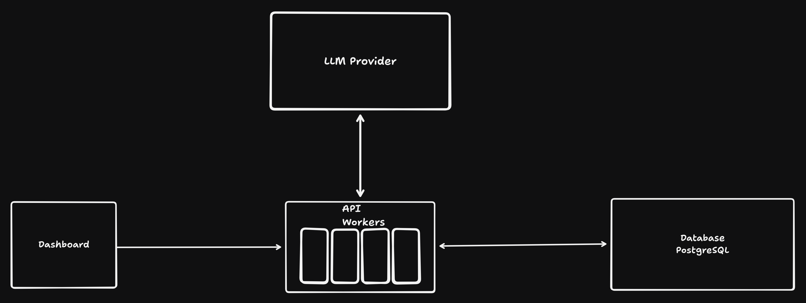

# Flowtrace

## What is it?

Flowtrace is an AI workflow evaluation tool.

## Who is it for?

Flowtrace is for anyone who has AI workflows running that are
not up to your expectations and want to make it work for you
rather than against you.

## Architecture

## MVP Features

1. Create workflows

2. Workflow payload submission
    - raw and structured

3. Async job execution

4. Manage workflow runs

5. Structured output validation

6. Failure + retry handling

## What is out of scope?

1. Prompt versioning

2. Manual review of the workflow outputs

3. External API access

4. Metrics dashboard
